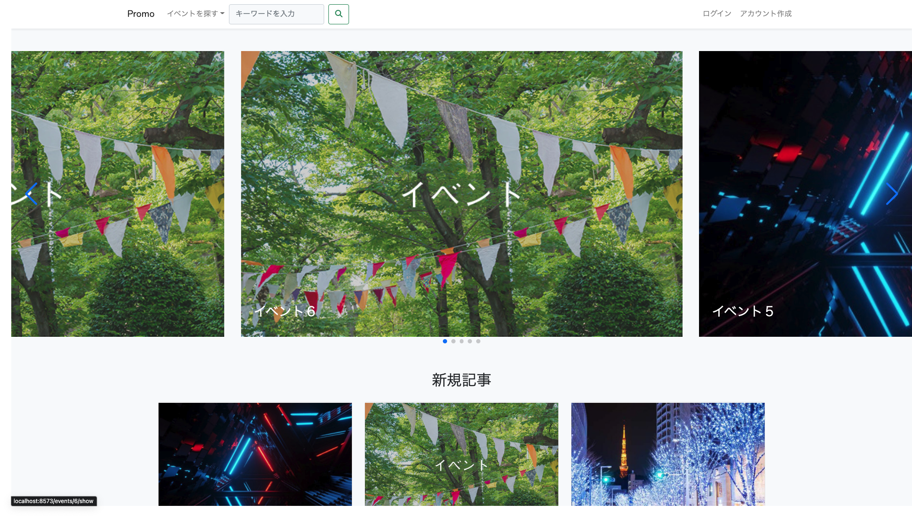
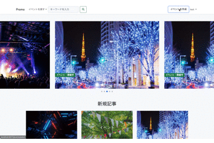
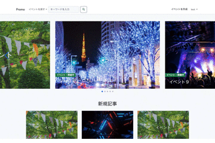
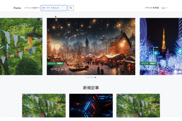
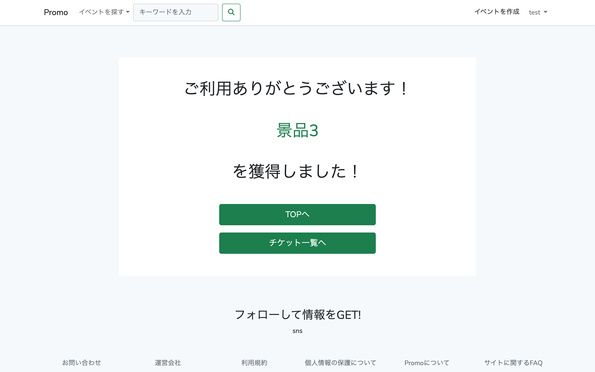
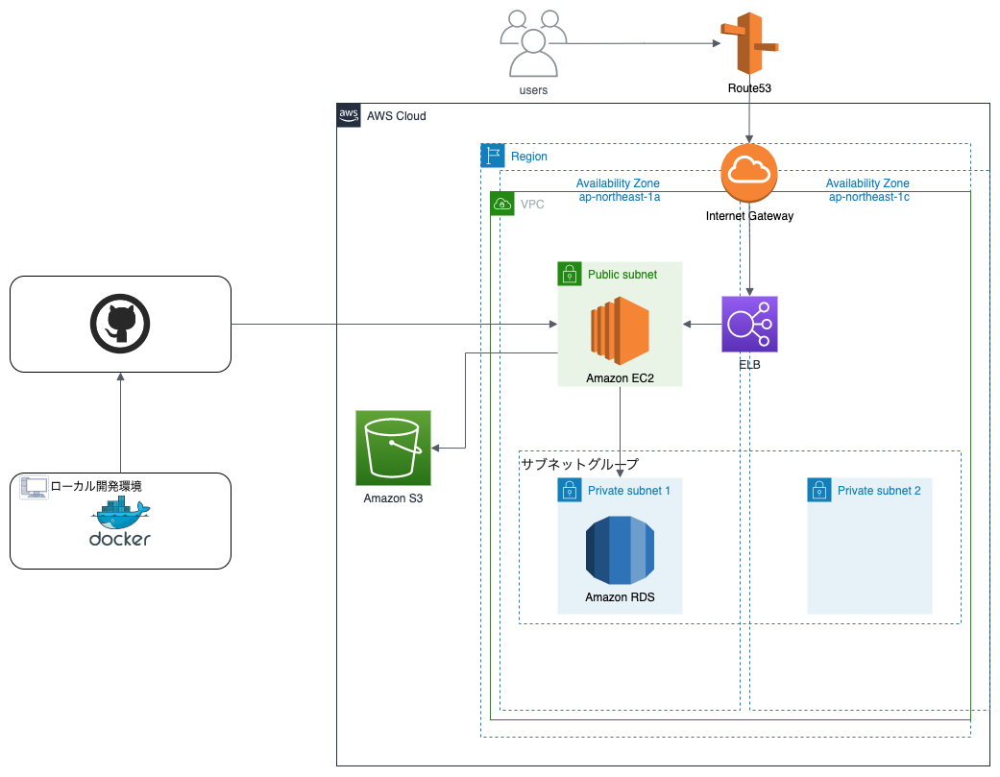
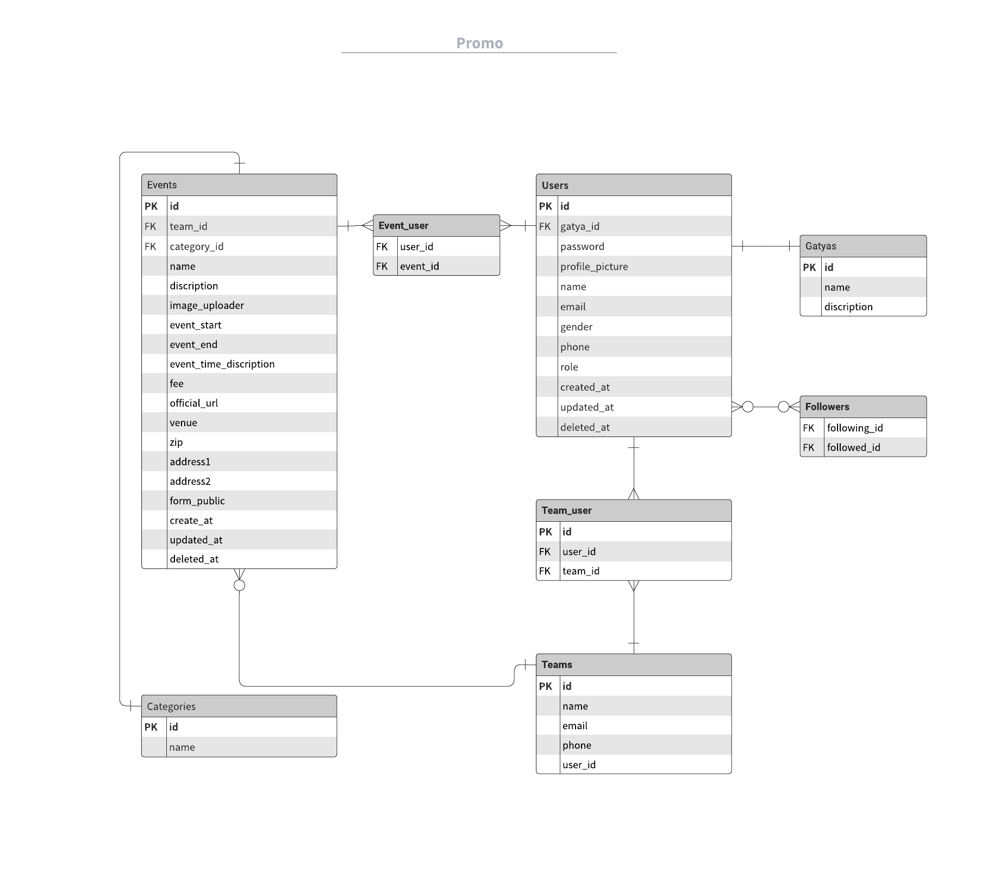

# 開催イベントを・作成・管理ができるWebアプリケーション【Promo】

## 概要
主催者側がイベントスタッフと開催場所の確保、集客が簡単にできイベントを誰でも企画・開催できるようなサービスをコンセプトとしました。

## URL : [Promo](http://54.178.80.114/ "Promo Home")

## 制作背景
InstagramやTwitterなどのSNSでの集客だと不特定多数の人に表示はされるが、
検索時にはあまりヒットしないという課題が見つかりました。

**課題まとめ**
- SNSで運営しようとするとチームでイベントを運営することが大変。
- 文字数制限があり分割などをして投稿する必要がある。

# 画面基本操作
**●イベント情報の新規作成** 

*ログイン後(ユーザー登録必須)

① TOP画面からイベント情報の新規作成  
② チームを作成・選択  
③ イベントの情報を入力して作成  
④ イベントの作成が完了して、詳細ページで入力した内容を確認

**●マイページからイベント情報やチームを管理**

① マイページに遷移  
② イベント・主催者チームの管理タブからイベント情報を確認や管理ができる  

**●イベント情報の検索**

① TOPページで検索したいキーワードを入力して、検索ボタンを押下  
② 検索値での該当顧客が表示  

**●イベントで使用できる特典**

① ユーザーの新規作成時にて特典を付与  
② マイページの「プロフィールを編集する」を押下  
③ チケット一覧タブから所持チケットを確認  

# 使用技術
バックエンド  
PHP 8.1.7 / Laravel 8.83.16

フロントエンド  
HTML / CSS / javascript / Bootstrap

インフラ  
mysql 8.0.25  
AWS(EC2, S3, RDS, Route 53, ELB, IAM)  
Docker 20.10.7 / Docker compose 1.29.1 (開発環境)

その他の使用技術  
git(gitHub) / Visual Studio Code / gmail(メール)  
Adobe XD(画面遷移図) / lucidchart(ER図) / Drawio(AWS構成図)  
Sequel Ace(SQLクライアントツール)

# AWS構成図

# DB設計図
**・ER図**

**・各種テーブル**
| テーブル名 | 定義 |
|---|---|
| Users(ユーザー) | ユーザー登録情報 |
| Events(イベント) | イベントの登録情報 |
| Teams(チーム) | イベントチームの登録情報 |
| Categories(カテゴリー) | カテゴリー情報 |
| Gatya(ガチャガチャ) | 特典 |
| Followers(フォロー) | フォロー・フォロワー |

# アプリ機能一覧
### メイン機能
- イベント情報の新規作成・表示・編集・削除（CRUD処理）  
- チームの作成・表示・編集・削除（CRUD処理）  
- チーム招待・参加  
- イベント特典付与  
- イベント情報検索  

### 認証機能
- ユーザー登録・ログイン・ログアウト  
- メールアドレス認証  
- メールアドレス変更  
- パスワード再設定  
- ユーザープロフィール編集  

## 最後に
大変お忙しい中、最後までご覧いただき誠にありがとうございました。
ご興味を持っていただけましたら、下記リンクもご覧頂けると幸いです。